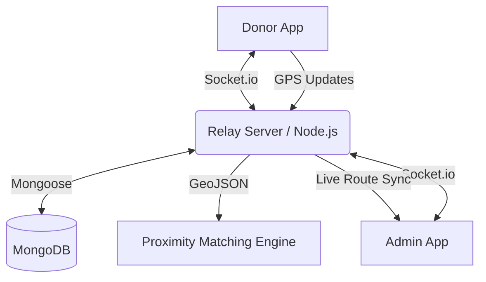

# BloodBridge 🩸
### *Precision Blood Coordination — Every Drop Counts.*

**BloodBridge** is a premium, real-time health-tech platform designed to bridge the gap between donors and hospitals during critical emergencies. It leverages geo-spatial intelligence, medical compatibility logic, and live mission tracking to ensure life-saving resources reach their destination with maximum efficiency.

---

## 🏗️ System Architecture

BloodBridge is built as a distributed real-time system, comprising a high-performance Node.js backend and this visually-rich React frontend.



---

## 🔥 Key Innovation Systems

### 1. Geo-spatial Proximity Matching
When a hospital broadcasts an emergency request, our **Proximity Engine** calculates spherical distances using MongoDB's `$geoNear`. It automatically filters for:
- Compatible blood types (Medical mapping).
- Donor eligibility (56-day cooldown check).
- Proximity radius (Optimized for response time).

### 2. Live Mission Tracking
Once a donor accepts a request, a **Live Mission** is initiated.
- **Bi-directional Sync**: Real-time GPS coordinates are streamed via WebSockets.
- **Dynamic Routing**: Admins see the donor's live progress on a map relative to the hospital.
- **State Persistence**: Mission states persist across refreshes using backend synchronization.

---

## 🌐 Frontend Features

### 📡 Real-time Mission Tracking
- **Interactive Map**: Built with Leaflet, visualizing hospital locations, donor positions, and active routes.
- **Dynamic Status**: Instant updates on donation lifecycle (Requested → Accepted → Traveling → Donating).
- **Socket.io Integration**: Low-latency event streaming for location updates and system notifications.

### 🩸 Proximity Alerts & Requests
- **Emergency Broadcasts**: Instant, priority-based notification system for nearby donors.
- **Urgent UI**: High-contrast, accessibility-focused design to ensure critical alerts are never missed.
- **Blood Compatibility Filtering**: Automatic UI filtering based on medical compatibility.

### 🏆 Donor Dashboard
- **Impact Stats**: Visual progress tracking of lives saved and donation history.
- **Rewards System**: Integrated points and rewards visualization to drive community engagement.

---

## 🛠️ Technology Stack

- **Framework**: [React 19](https://react.dev/)
- **Build Tool**: [Vite 7](https://vitejs.dev/)
- **Type Safety**: [TypeScript](https://www.typescriptlang.org/)
- **Styling**: [Tailwind CSS v4](https://tailwindcss.com/)
- **Animations**: [Framer Motion](https://www.framer.com/motion/)
- **Real-time**: [Socket.io-client](https://socket.io/docs/v4/client-api/)
- **Maps**: [Leaflet](https://leafletjs.com/) & [React-Leaflet](https://react-leaflet.js.org/)
- **State Management**: [Zustand](https://zustand-demo.pmnd.rs/)

---

## 🚀 Getting Started

### 1. Prerequisites
- Node.js (v18+)
- Local backend running (Refer to [Backend README](../backend/README.md))

### 2. Installation
```bash
# From the project root
cd BloodBridge
npm install
```

### 3. Environment Configuration
Create a `.env` file in the `BloodBridge/` directory:
```env
VITE_API_URL=http://localhost:3000/api
VITE_SOCKET_URL=http://localhost:3000
```

### 4. Development Server
```bash
npm run dev
```

---

## 📁 Project Structure

```text
src/
├── components/   # Modular UI components (MissionTracker, EmergencyForm, etc.)
├── pages/        # Main application views (Dashboard, Landing, MapView)
├── lib/          # Utilities, API clients, and constants
├── store/        # Zustand state stores (Authentication, Tracking State)
├── data/         # Mock data and static configuration
├── assets/       # Visual resources and icons
└── main.tsx      # Application entry point
```

---

## 🎨 Design Principles
BloodBridge follows a **Premium Health-Tech** aesthetic:
- **Typography**: Clean, readable sans-serif fonts (DM Sans / Inter).
- **Color Palette**: Warm "Blood-Rescue" tones—vibrant oranges, deep reds, and soft cream backgrounds.
- **Interactions**: Fluid micro-animations using Framer Motion to reduce user anxiety during emergencies.

---

*Built with ❤️ to save lives.*
